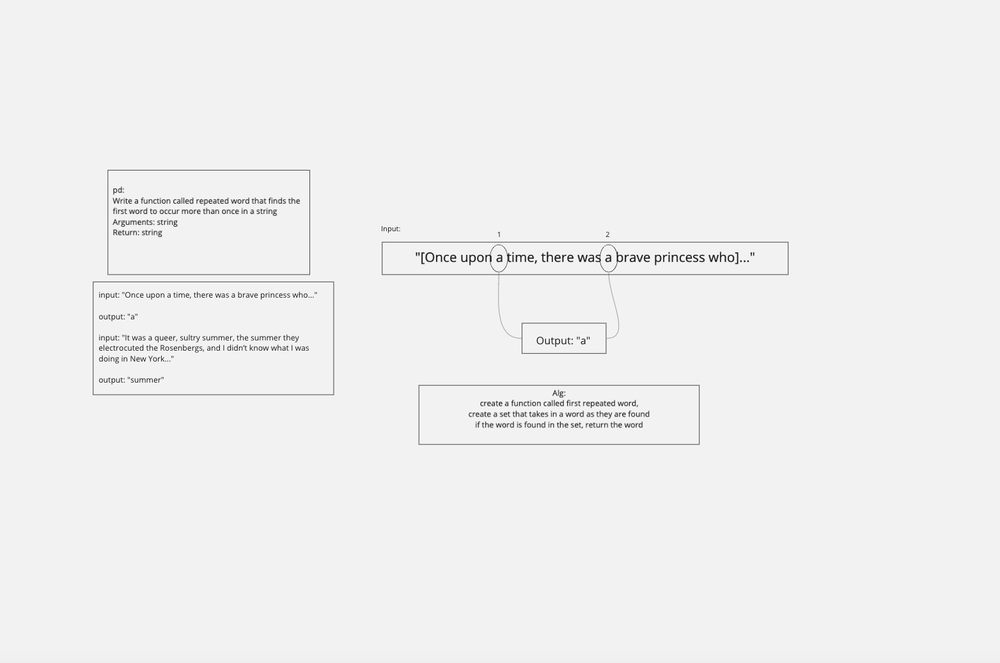

# Hashmap-Repeated-Word
- Find the first repeated word in a book.

## Challenge
- Write a function called repeated word that finds the first word to occur more than once in a string

### Input/Output
- Input: String
- Output String

## Whiteboard

## Approach & Efficiency
- BigO
  * Space: O(1)
  * Time: O(n)
