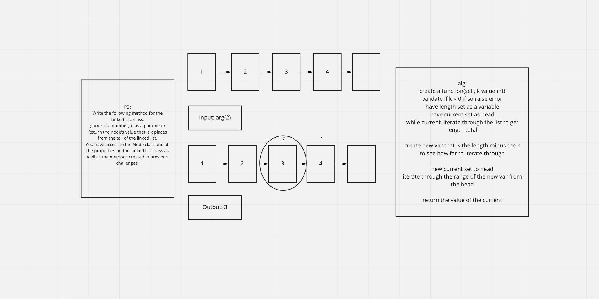

# Linked List Kth
- k-th value from the end of a linked list.

## Challenge
**Features**
- Write the following method for the Linked List class:

### kth from end
- input: argument: a number, k, as a parameter.
- Return the node’s value that is k places from the tail of the linked list.
- You have access to the Node class and all the properties on the Linked List class as well as the methods created in previous challenges.

## Whiteboard

## Approach & Efficiency
- Time Big 0(1)
- Space Big0(n)
