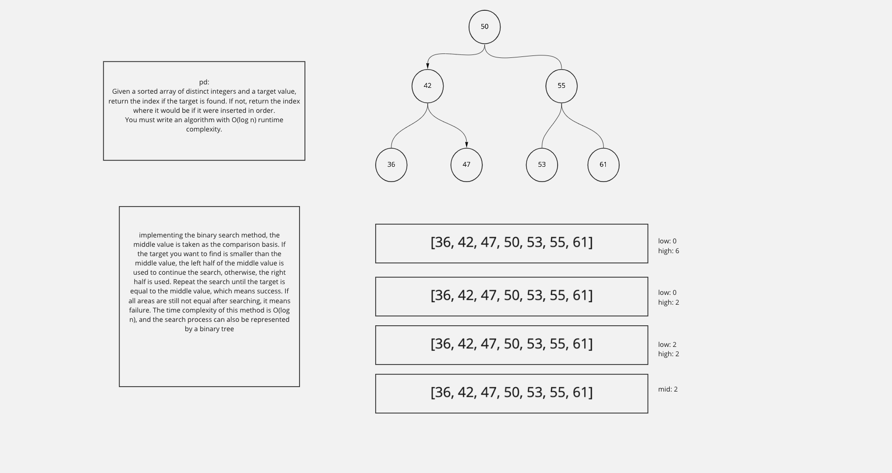

# Search Insert Position

## Problem Domain:
- Given a sorted array of distinct integers and a target value, return the index if the target is found. If not, return the index where it would be if it were inserted in order.

## Test Case:
**Example 1:**

- Input: nums = [1,3,5,6], target = 5
- Output: 2

**Example 2:**

- Input: nums = [1,3,5,6], target = 2
- Output: 1

**Example 3:**

- Input: nums = [1,3,5,6], target = 7
- Output: 4

## Whiteboard:

## Approach & Efficiency:
- Time: O(logN)
Space: O(1)
