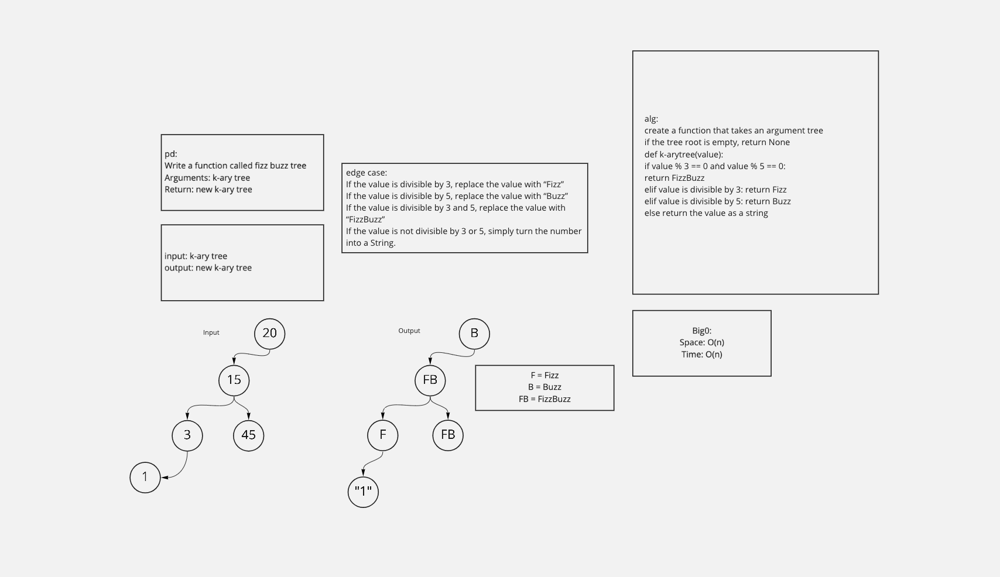

# "FizzBuzz” on a k-ary tree
- Set the values of each of the new nodes depending on the corresponding node value in the source tree.

## Featured Task:
- Write a function called fizz buzz tree
- Arguments: k-ary tree
- Return: new k-ary tree
- Determine whether or not the value of each node is divisible by 3, 5 or both. Create a new tree with the same structure as the original, but the values modified as follows:

- If the value is divisible by 3, replace the value with “Fizz”
- If the value is divisible by 5, replace the value with “Buzz”
- If the value is divisible by 3 and 5, replace the value with “FizzBuzz”
- If the value is not divisible by 3 or 5, simply turn the number into a String.

## Whiteboard:

## Approach & Efficiency:
- Time complexity: O(N) if queue is used.
- Space complexity: O(N) because a new tree is produced that is proportional in size to the original.
