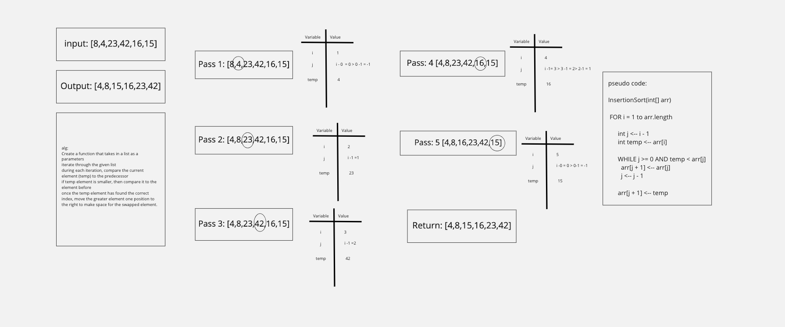

# Blog Notes: Insertion Sort

- Insertion sort is a simple sorting algorithm that works similar to the way a player sorts playing cards in their hands either by lowest to highest or highest to lowest.

## Example of insertion sort


# Working Python Code
```
def insertionSort(list):

	for i in range(1, len(list)):

		temp = list[i]
		j = i-1

		while j >= 0 and temp < list[j] :

			list[j + 1] = list[j]
			j -= 1

		list[j + 1] = temp

```
## Efficiency
- Time
  * 0(n^2)
- Space
  * 0(1)
